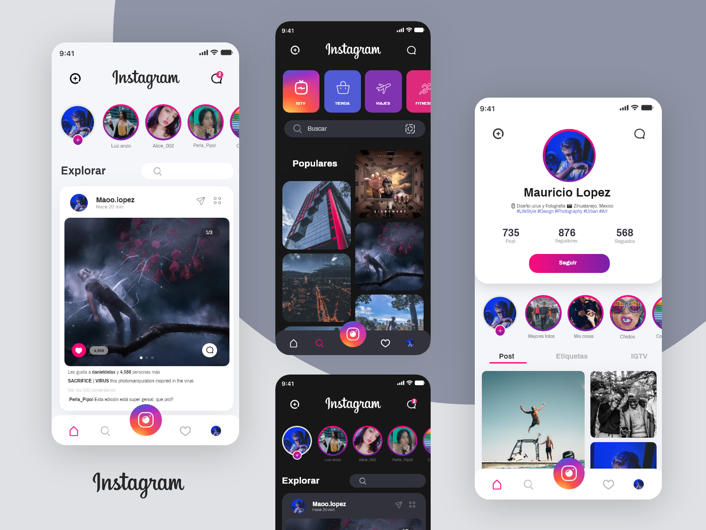
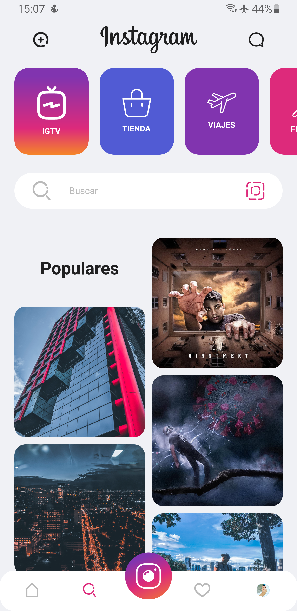
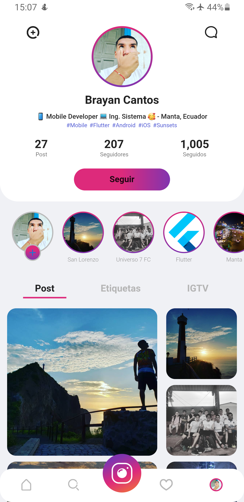
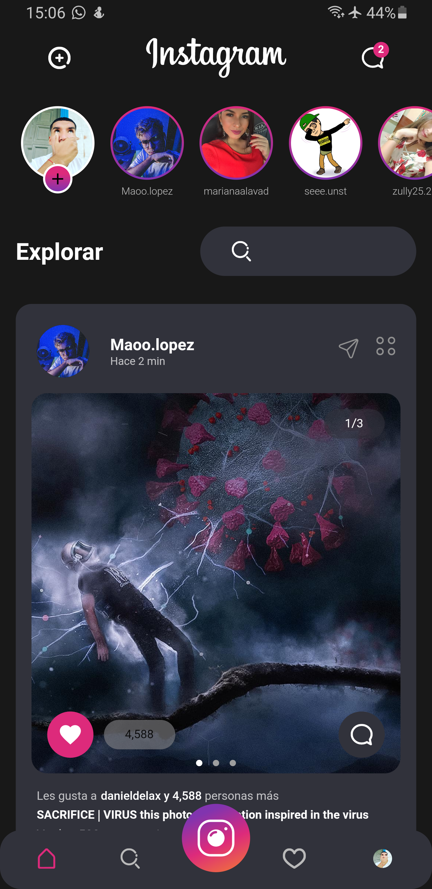
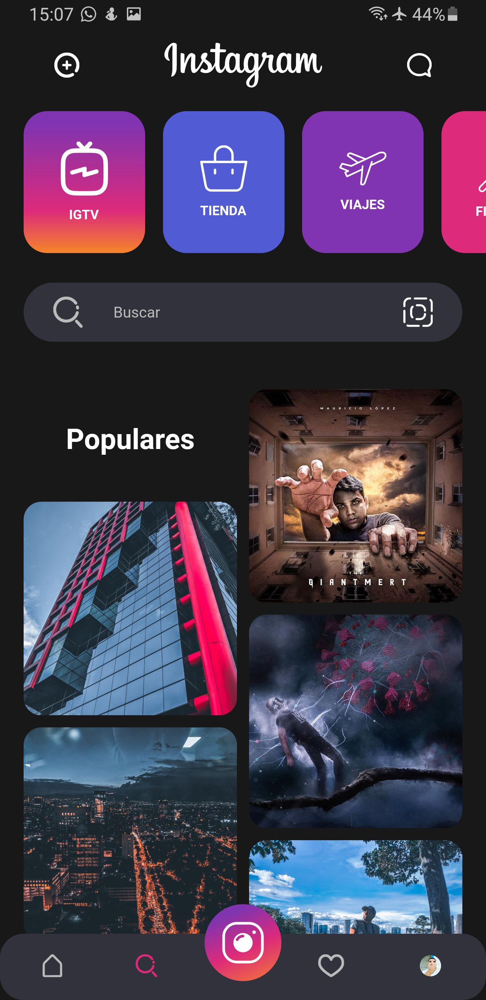
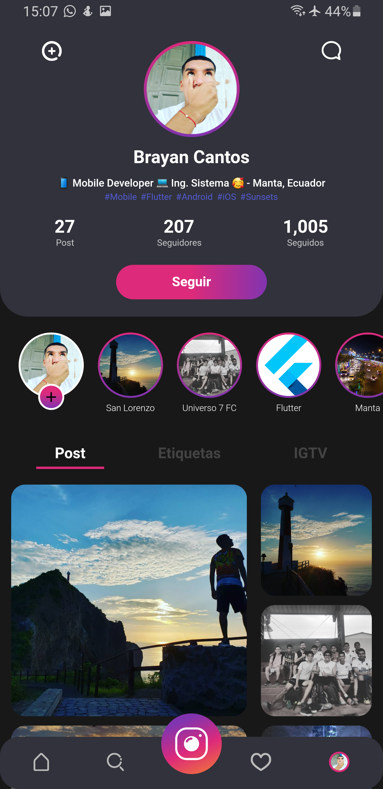
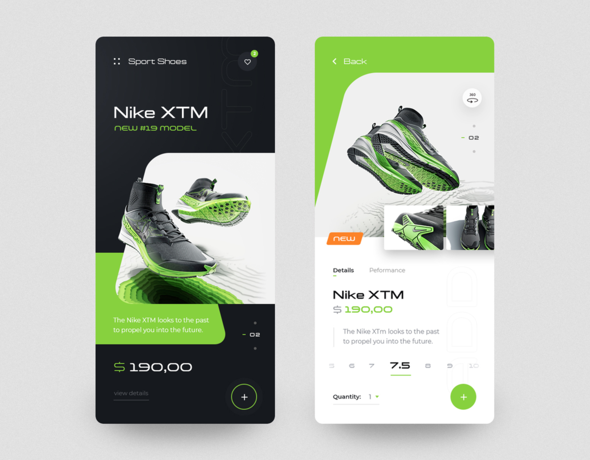
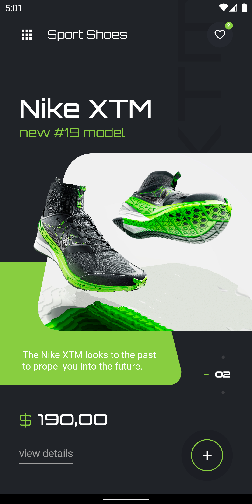

# FLUTTER SAMPLES

## 01 - INSTAGRAM REDESING BY MAURICIO LOPEZ
- ### [INSPIRATION](https://dribbble.com/shots/14194596-Instagram-Redesign-UI?fbclid=IwAR2Db-jYEEFIp5O55wHLjylZ-vpwnAOgqCTEoWjDxuFoAuFr8Vu4htS2YYA)

### CONTACT MAURICIO LOPEZ
- [Behance](https://www.behance.net/designylove)
- [Dribble](https://dribbble.com/m4st3rmiau)
- [Instagram](https://www.instagram.com/maoo.lopez/)

## LIGHT MODE WITH FLUTTER
<TABLE BORDER>
    <TR>
        <TH>HOME LIGHT</TH>
        <TH>SEARCH LIGHT</TH>
        <TH>PROFILE LIGHT</TH>
    </TR>
	<TR>
		<TD></TD> 
        <TD></TD> 
        <TD></TD>
	</TR>
</TABLE>

## DARK MODE WITH FLUTTER
<TABLE BORDER>
    <TR>
        <TH>HOME DARK</TH>
        <TH>SEARCH DARK</TH>
        <TH>PROFILE DARK</TH>
    </TR>
	<TR>
		<TD></TD> 
        <TD></TD> 
        <TD></TD>
	</TR>
</TABLE>

## HEART ANIMATION WHEN I LIKE IT
<TABLE BORDER>
    <TR>
        <TH>HEART ANIMATION</TH>
    </TR>
	<TR>
		<TD></TD>
	</TR>
</TABLE>

## 02 - NIKE SHOES CONCEPT BY NETFLAYO
- ### [INSPIRATION](https://dribbble.com/shots/6054742-Nike-Shop-App-concept)

### CONTACT NETFLAYO
- [Behance](https://www.behance.net/tonyrousseau)
- [Dribble](https://dribbble.com/netflayo)
- [Instagram](https://www.instagram.com/netflayo/)

## NIKE SHOES WITH FLUTTER
<TABLE BORDER>
    <TR>
        <TH>HOME NIKE SHOES</TH>
        <TH>DETAIL NIKE SHOES</TH>
    </TR>
	<TR>
		<TD></TD> 
        <TD></TD>
	</TR>
</TABLE>